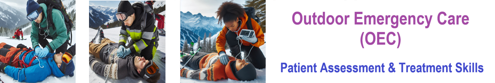
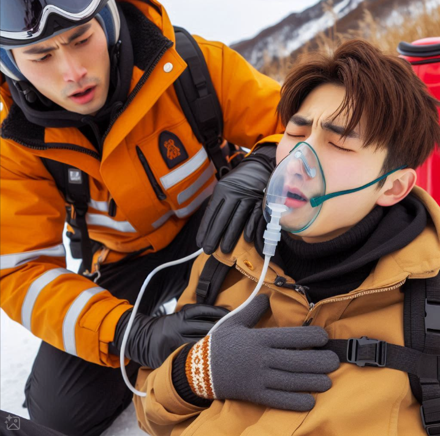

    
# Nsp Skill Respitory Assessment 

## Ski Patrol Skill for performing a Respitory assessment - breathing. 

    

    

Here’s a clear and concise version for a respiratory assessment:

### Steps for Respiratory Assessment:

1. **Preparation**:
   - Ensure the **scene is safe** and use **standard precautions**.
   - **Introduce yourself** and obtain permission to assist.

2. **Observe Breathing**:
   - **Look and feel** for the chest to rise and fall.

3. **Assess Key Aspects**:
   - **Rate**: Count the breaths per minute.
   - **Rhythm**: Check if the breathing is regular or irregular.
   - **Depth**: Note if the breaths are shallow or deep.
   - **Effort**: Observe for any signs of labored or effortless breathing.
   - **Noise**: Listen for unusual sounds, such as wheezing, gurgling, or stridor.

### Characteristics of Normal or Good Breathing (Adults and Children):

1. **Rate**:
   - **Adults**: **12 to 20 breaths per minute**
   - **Children**:
     - **Infants (0-1 year)**: **30 to 60 breaths per minute**
     - **Toddlers (1-3 years)**: **24 to 40 breaths per minute**
     - **Preschoolers (3-6 years)**: **22 to 34 breaths per minute**
     - **School-aged children (6-12 years)**: **18 to 30 breaths per minute**
     - **Adolescents (12-18 years)**: **12 to 20 breaths per minute**

2. **Rhythm**:
   - **Regular and even**: Breathing should have a consistent pattern, with no sudden pauses or irregularities.
   - **Smooth and continuous**: Pauses between breaths should not be prolonged or erratic.

3. **Depth**:
   - **Moderate and consistent**: Each breath should involve a steady rise and fall of the chest or abdomen, depending on the age group.
   - **Age Considerations**: Infants and young children often breathe with their abdomen, which is normal.

4. **Effort**:
   - **Effortless**: Breathing should be easy, without visible strain.
   - **No use of accessory muscles**: In adults, children, and infants, there should be no exaggerated use of neck, shoulder, or abdominal muscles. Straining, nasal flaring, or grunting can indicate difficulty breathing.

5. **Noise**:
   - **Quiet and gentle**: Breathing should be silent or very faint.
   - **No abnormal sounds**: There should be no wheezing, stridor, gurgling, or other sounds that indicate a problem with airflow.

    

    
## Getting Started

The goal of this solution is to **Jump Start** your development and have you up and running in 30 minutes. 

To get started with the **Nsp Skill Respitory Assessment** solution repository, follow these steps:
1. Clone the repository to your local machine.
2. Install the required dependencies listed at the top of the notebook.
3. Explore the example code provided in the repository and experiment.
4. Run the notebook and make it your own - **EASY !**
    
## List of Figures
             
    

## Github https://github.com/JoeEberle/ - Email  josepheberle@outlook.com 
    

    